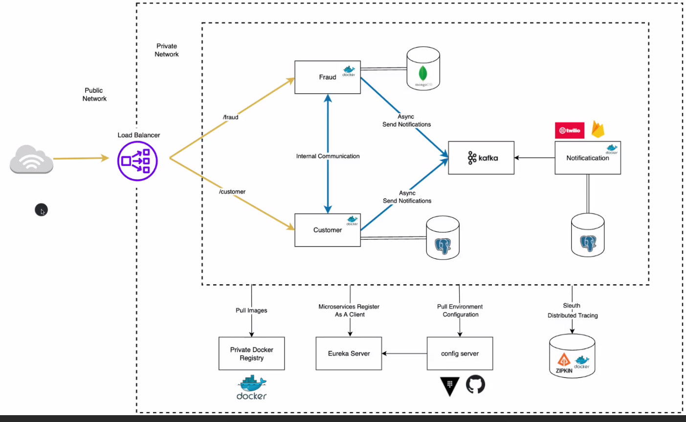
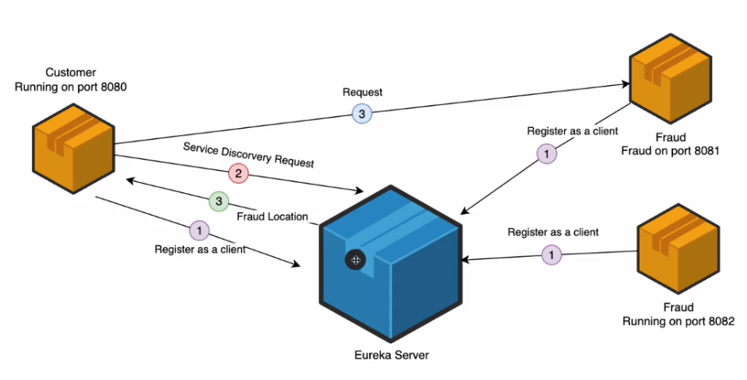

# Microservices with Spring Boot and Spring Cloud by Amigoscode

## Table of Contents
- [High Level design](#High-Level-design)
- [FeignClient vs RestTemplate](#feignClient-vs-restTemplate)
- [Eureka Server](#Eureka-Server)

[//]: # (- [Microservices]&#40;#microservices&#41;)

[//]: # (- [Spring Boot]&#40;#spring-boot&#41;)

[//]: # (- [Spring Cloud]&#40;#spring-cloud&#41;)

[//]: # (- [Spring Cloud Config Server]&#40;#spring-cloud-config-server&#41;)

[//]: # (- [Spring Cloud Service Discovery]&#40;#spring-cloud-service-discovery&#41;)

[//]: # (- [Spring Cloud API Gateway]&#40;#spring-cloud-api-gateway&#41;)

[//]: # (- [Spring Cloud Circuit Breaker]&#40;#spring-cloud-circuit-breaker&#41;)

[//]: # (- [Spring Cloud Stream]&#40;#spring-cloud-stream&#41;)

[//]: # (- [Spring Cloud Task]&#40;#spring-cloud-task&#41;)

[//]: # (- [Spring Cloud Data Flow]&#40;#spring-cloud-data-flow&#41;)

[//]: # (- [Conclusion]&#40;#conclusion&#41;)

[//]: # (- [References]&#40;#references&#41;)

## High Level Design

## FeignClient vs RestTemplate
- FeignClient can centralize all the HTTP requests in one place.
- RestTemplate requires to create a response interface for each service, which causes a lot of boilerplate code.

## Eureka Server
- Eureka server is a centralized that maintains a list of all registered services and their instances.
- Can be used as service discovery to locate services by their namespace.

