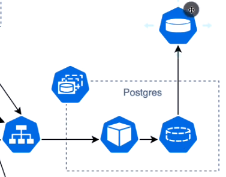

# Microservices with Spring Boot and Spring Cloud by Amigoscode

## Table of Contents
- [High Level design](#High-Level-design)
- [FeignClient vs RestTemplate](#feignClient-vs-restTemplate)
- [Eureka Server](#Eureka-Server)

[//]: # (- [Microservices]&#40;#microservices&#41;)

[//]: # (- [Spring Boot]&#40;#spring-boot&#41;)

[//]: # (- [Spring Cloud]&#40;#spring-cloud&#41;)

[//]: # (- [Spring Cloud Config Server]&#40;#spring-cloud-config-server&#41;)

[//]: # (- [Spring Cloud Service Discovery]&#40;#spring-cloud-service-discovery&#41;)

[//]: # (- [Spring Cloud API Gateway]&#40;#spring-cloud-api-gateway&#41;)

[//]: # (- [Spring Cloud Circuit Breaker]&#40;#spring-cloud-circuit-breaker&#41;)

[//]: # (- [Spring Cloud Stream]&#40;#spring-cloud-stream&#41;)

[//]: # (- [Spring Cloud Task]&#40;#spring-cloud-task&#41;)

[//]: # (- [Spring Cloud Data Flow]&#40;#spring-cloud-data-flow&#41;)

[//]: # (- [Conclusion]&#40;#conclusion&#41;)

[//]: # (- [References]&#40;#references&#41;)

## High Level Design

## FeignClient vs RestTemplate
- FeignClient can centralize all the HTTP requests in one place.
- RestTemplate requires to create a response interface for each service, which causes a lot of boilerplate code.

## Eureka Server
- Eureka server is a centralized that maintains a list of all registered services and their instances.
- Can be used as service discovery to locate services by their namespace.

## Distributed tracing
- Sleuth leverages logs by adding trace and span ids to the logs. Just install library and it will do the rest.
- Zipkin is GUI that shows the trace of requests. In order to use it:
  - Install Zipkin server by docker: `docker run -d -p 9411:9411 openzipkin/zipkin`
  - Add `spring-cloud-starter-zipkin` dependency to the project.
  - Add `spring.zipkin.baseUrl=http://localhost:9411` to the `application.properties` file.

## Message queue
- Allow asynchronous communication between services.
- Could perform as load balancing, allow consumers to process messages at their own pace, prevent overloading during high traffic
- Allow scale horizontally by adding more consumers to process messages concurrently.
- In case of failure of a consumer, the message can be stored until the consumer is up again and process the message. Ensure no data lost.

## Jib to embed docker image build into maven (package phase)
- From root pom.xml, add the following plugin:
  - jib-maven-plugin as plugin
  - Specify image name and tag `clipse-temurin:17` is java run time image
  - Add execution phase to indicate when to build the image
- From microservices, 
  - Add profile to specify the image name and tag
- To build the image, run `mvn clean package -P build-docker-image` (P is profile)

## Kubernetes (K8s)
- Cluster is set of nodes, node can be VM or physical machine
  - Node can be a master node or worker node.
  - Master node is responsible for managing the cluster
  - Worker node is responsible for running the application.
- Master node contains Control Plane which includes 
  - API server:  All communications go through API server External and Internal. Expose Restful api on port 443. Frontend for the k8s control plane.
  - Scheduler: Watch for new pods and assign them to nodes based on scheduling factors, check health, resources, port available and affinity rules...
  - Cluster store: Store configuration and state of the cluster. It's a distributed key-value store.
  - Control manager: Node controller, bring node alive if one dies. Watch api server for changes and make sure the cluster is in the desired state. 
  - Cloud controller manager: Interact with cloud provider
- Worker node: VM or physical machine, provides running environment for applications. 3 main components:
  - Kubelet: Main agent running on each nod, receives Pod def from API server, interacts with Container runtime to run the pod, report status to master node (via API server)
  - Container runtime: Pull images from docker registry, run containers, 
  - Kube-proxy: Local cluster networking, each node gets unique IP,

- Deploy a statefulSet, usually for database, message queue, cache, see code in `k8s/minikube/bootstrap/postgres` and picture below:
  - 